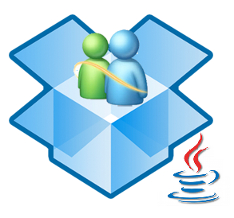

# DropboxMSN
A messenger for Dropbox.

**Author:** Juan Luis Suárez Díaz.

Dropbox MSN is no longer supported in this way. If you want to get the latest version, visit [No More Dropbox MSN](https://github.com/jlsuarezdiaz/NoMoreDropboxMSN).

## Install

- Clone this repository and import it in Netbeans IDE.

- Select Clean and Build option from the IDE options.

- Go to the project folder. Now you will find the JAR File Executable at ./dist/DropboxMSN.jar

- Go to the shared folder you want in your Dropbox (it must be installed). Once there, add the following directories:
  - ./_msnsys/
  - ./_msnsys/_kermsn
  - ./_msnsys/_msgcloud
  - ./_msnsys/_pmcloud

- Copy the JAR executable in the shared folder and start chatting!

## Running Dropbox MSN

- From Windows: double click on the JAR file.

- From Command Line: java -jar "DropboxMSN.jar"

## Requirements

- Java SE Development Kit 8 ([JDK 1.8](http://www.oracle.com/technetwork/java/javase/downloads/jdk8-downloads-2133151.html))

- [Dropbox](https://www.dropbox.com/) account and computer installation.